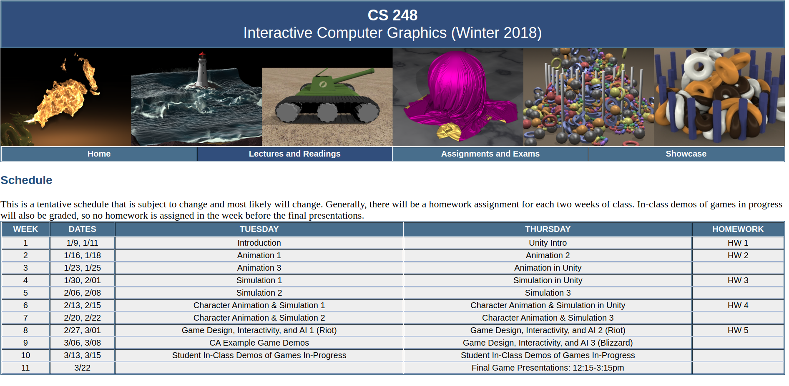

# CS-248-Interactive-Computer-Graphics

`https://web.stanford.edu/class/cs248/lectures.html`

## Course Outline

1. INtroduction

2. Unity Intro

3. Animation Part I

4. Animation Part II

5. Animation Part III

6. Animation in Unity

7. Particles

8. Particle systems

9. Rigid Bodies

10. Articulated Character Part I

11. Character Animation and Physics in Unity

12. Articulated Character Part II

13. Skinning
